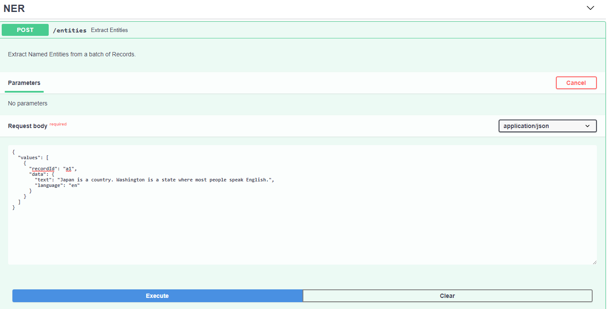

# Smart Learning Workspace

The backend repository for the smart learning workspace

---

## Resources
This project has two key dependencies:

| Dependency Name | Documentation                | Description                                                                            |
|-----------------|------------------------------|----------------------------------------------------------------------------------------|
| FastAPI         | https://fastapi.tiangolo.com | FastAPI framework, high performance, easy to learn, fast to code, ready for production |
---

## Run Locally
To run locally in debug mode run:

```
cd ./smart_learning_workspace
uvicorn app.api:app --reload
```
Open your browser to http://localhost:8000/docs to view the OpenAPI UI.




For an alternate view of the docs navigate to http://localhost:8000/redoc

---
